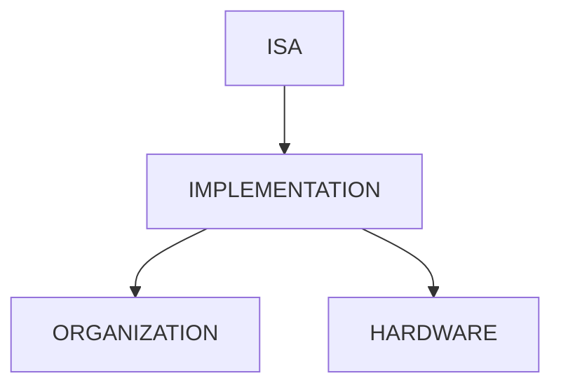
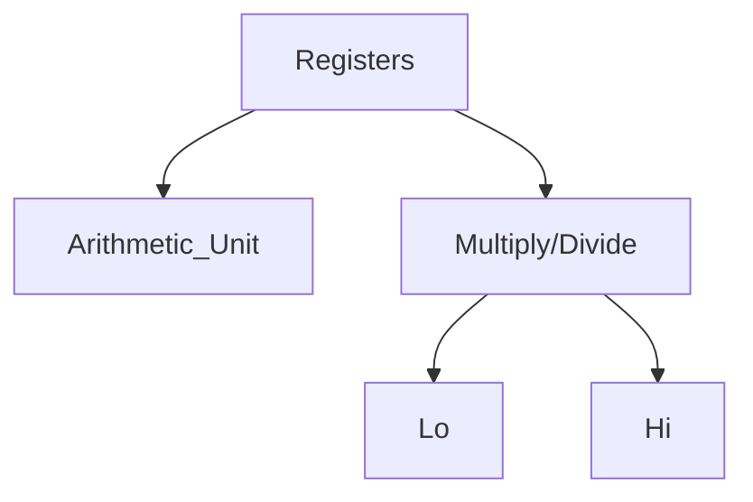
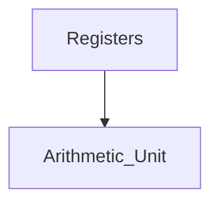
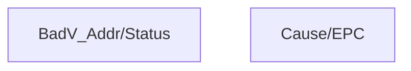

# COMPSYS304 Notes

[TOC]

## Part 1

### Lectures 1-4


**ISA:** Programmer-visible instructions - Boundary between the hardware and software

**Organization:** High level aspects of computer design ( CPU, memory)

**Hardware:** Detailed logic design, circuit-level design.

**ISA** must define

- Instruction format on encoding.
- Data type and size
- Location of operands and results


**Fetch:** Acess memory to get the next instruction

**Decode:** Interpret the bits of the instruction word.

**Execute:** Perform that specific instruction


**RISC ISA:** All instructions have the same size

- Load/Store architecture(Only load and store instructions can access memory)
- Other instructions use registers


| Type               | Size                                |
| ------------------ | ----------------------------------- |
| Data word          | 32 bits(4bytes)                     |
| Instruction word   | 32 bits(4bytes)                     |
| Registers          | 32 general purpose 32-bit registers |
| Addressable Memory | $2^{32}$ bytes                      |
| Operands           | `signed`, `unsigned`, `immediate`   |

*To make the implementation simpler and faster, the number of instructions in the ISA should be reduced as much as possible.*


#### Word byte arrangement. (Byte order)
*SPIM uses little-endian on PC*
###### Big-endian:
  **Memory**
| Byte 4 | addr (MSB)
| Byte 3 | addr + 1
| Byte 2 | addr + 2
| Byte 1 | addr + 3 (LSB)

###### Little-endian:
  **Memory**
| Byte 1 | addr (LSB)
| Byte 2 | addr + 1
| Byte 3 | addr + 2
| Byte 4 | addr + 3 (MSB)

The memory address in the bare MIPS machine is represented as $C(r_x)$, which is the sum of the immediate value ($C$) , and the contents of register $r_x$

***Example:***

```assembly
lw $5,100($3)
```

The contents of register `$3` is added to `100` and the result will be used as the memory address where its contents is read and copied into destination register `$5` 

```assembly
sw $12,240($9)
```

The contents of register `$9` is added to `240` and the result will be used as the the memory address where the contents of register `$12` will be written there.

***Note: Memory addresses must be properly aligned*** 

#### Changing the Control Flow of the program

To implement `if-else` constructs or `loop` constructs, use `branch` and `jump` instructions for <u>conditional</u> and <u>unconditional</u> control transfers.

###### Unconditional Branches(Jumps)

Jump to another location in memory to fetch the next instruction.(**J-Type** format)

```assembly
j target_address
```

- `target_address` indicated using a label(e.g. `L1`)
- `target_address` is a 26-bit number, then it is shifted 2bits to the left to be come 28bits. Then the 4 most significant bits of PC are attached (concatenated) to these 28bits to make the 32-bit target address.

###### Conditional Branches

Jump to another location in memory to fetch the next instruction when a specific *boolean condition* is **TRUE.**

***Example:***

```assembly
beq register1,register2, label
```

`branch on equal` - jump to the target address if the contents of `register1` and `register2`  are equal

```assembly
bne register1,register2,label
```

`branch on not equal` - jump to the target address if the contents of `register1` and `register2` are not equal.

`label` (for both `beq` and `bne`) is a 16-bit signed number. It is first **shifted 2-bits to the left** and then is added to PC+4 (PC is the address of the conditional branch)

*`beq` and `bne` instructions use I-Type instruction format for encoding* 

###### Address calculation for `beq` and `bne` instructions

Target address in a conditional branch is **PC-relative**. PC provides the address of the current instruction that is executed by the CPU.(`PC + 4`) 

***Example:*** 

If the memory for instruction `bne $10,$11, 0x100` is `0x0020 1000`, what will be the branch target address? (Use `PC+4`)

***Answer:*** address = 0x0020 1000 + 4 + 0x400 = 0x0020 1404

### Lectures 5-8

***Example1*** 

**(a)** Write the MIPS assembly code to divide each element of an array by 8. Each element of the array is a 32-bit integer and the array has 100 elements. Assume that the base address(the address of the first element) of the array is in register `$10`.

**(b)** How many instructions are <u>executed</u> in your code?

***Answer*** 

**(a)**

```assembly
	addi 	$11,$0,100	#$11 is the loop counter
L1:
	lw		$8,0($10)	#get the current element	
	sra		$9,$8,3		#divide by 8(shift right)
	sw		$9,0($10)	#store into $9
	addiu	$10,$10,4	#get the addr of next element
	addi	$11,$11,-1	#decrement loop counter
	ben		$11,$0,L1
```

**(b)** 601 instructions are executed.

#### Subroutine Call and Return

A **subroutine** or **procedure** is a **subprogram** that is usually executed more than once during the execution of the program. It helps to write a modular program in which each module may perform some specific task and uses one or more subroutines.

##### Subroutine <u>call</u>:

```assembly
jal address
```

- `address` indicates the adrress of the first instruction of the subroutine.
- Register `$31` is used to store the return address automatically.
- Difference to `j` instruction is that the contents of `PC+4`(PC will be the address of `jal` instruction) is copied into register `$31`.

##### Subroutine <u>return</u>:

```assembly
jr register
```

- MIPS instruction set architecture provides **jump register**. In this case the target address is the contents of the register.
- `jr $31` will be used as the return instruction.

#### Stack Frame

| Register Number | Register name |              Register Usage              |
| :-------------: | :-----------: | :--------------------------------------: |
|        0        |     zero      |              Constant zero               |
|        1        |      at       |          Reserved for assembler          |
|       2-3       |    v0 - v1    | Expression evaluation and results of a function |
|       4-7       |    a0 - a3    |          Argument1 to Argument4          |
|      8-15       |    t0 - t7    |  Temporary (not preserved across call)   |
|     16 - 23     |    s0 - s7    | Saved temporary (preserved across call)  |
|     24 - 25     |    t8 - t9    |  Temporary (not preserved across call)   |
|      26-27      |    K0 - K1    |          Reserved for OS kernel          |
|       28        |      gp       |          Pointer to global area          |
|       29        |      sp       |            **Stack pointer**             |
|       30        |      fp       |            **Frame pointer**             |
|       31        |      ra       |  Return address(used by function call)   |


The subroutine results are returned through **specific CPU registers** or through **stack frame**.

##### Layout of Memory for an executable MIPS Code

- **Text Segment:**  This part of the memory holds the instructions for the program. Below the user address space (0x4000 0000) is reserved for the operating system(kernel) and other special purpose tasks.
- **Data Segment:**  It starts above the text segment(starting at address 0x1000 0000), which is divided into two part. The static data portion contains objects whose size and address are known to the assembler (or compiler) and linker. Dynamic data will be stored above the static part.
- **Stack Segment:** It grows down, towards the data segment and is used to **save and restore the required data at the time of procedure call.** (**J-type** instructions)

Register PC keeps the address of **current instruction in execution**. When a procedure calls another procedure the contents of register PC is changed into the **starting address of the aclled procedure**. 

#### Summary of Stack Fram usage

- A procedure which does not call another procedure is called a **leaf** procedure.
- A **leaf** procedure does not need to save `$ra` register.
- All registers which are assumed unchanged by the *caller* **must be stored on the stack** *before being modified by the <u>called</u> procedure.* And then should be restored back before returning to the *caller*.
- A few arguments can be passed through registers( the first 4 argument through registers `$a0` to `$a3` in general case, or the first 2 floating-point values through registers `$f12` and `$f14`). **The rest of arguments must be passed through the stack frame.** 
- Most of the time, when a few local variables are used, they are assigned to registers. However, in some cases, the local variables are assigned on the stack frame and are accessed through the stack frame.

##### CPU:



##### Coprocessor 1 (FPU):



##### Coprocessor 0(Traps and Memory):



##### Example:

**(a)** Write a function in MIPS assembly which converts the lower case letters of an input string into upper case letters.

**(b)** Write the main program which calls this function with input string *"There Are Seven Words in This String." and prints the new string on SPIM console.

***Answer***

```assembly
		.data
str:	.asciiz	"There Are Seven Words in This String."

		.text
		.globl main
main:
		la $a0, str
		jal func1
		
		li $v0, 4	#print the result string
		la $a0, str
		syscall
		
		li $v0, 10	#exit the program
		syscall
		
func1:
		#$a0 points to the input string's starting address
		add $t0, $0, $a0
		
L1:
		lbu	$t0, $0, $a0
		beq	$t1, $0, L3		#end of string
		#check if it is a lower case letter (ASCII code from 0x61 to 0x7A)
		slti $t1, $t1, 0x61
		bne	$t2, $0, L2
		slti $t2, $t1, 0x7B
		beq $t2, $0, L2
		
		#convert to upper case
		addi $t1,$t1,-32	#0x20 difference bettwe lower case and upper case
		
L2:
		sb $t1,0($t0)
		addi $t0,$t0,1 	#point to the next char
		j L1

L3:
		jr $ra
```

### Lectures 9-12

#### FP registers and Software Conventions

To support IEEE standard for double precision, a register pair(`$f0` and `$f1` etc.) are used.

| Reg. Name        | Usage                        |
| ---------------- | ---------------------------- |
| `$f0` .. `$f2`   | Results of a function        |
| `$f4` .. `$10`   | Temporary registers          |
| `$f12` .. `$f14` | Pass the first two arguments |
| `$16` .. `$f18`  | Temporary registers          |
| `$f20` .. `$f30` | Caller saved registers       |


#### FPU Control Registers

Two control registers are provided.

- Control/Status register(`$31`) is used to control and monitor exceptions, ***hold the result of compare operations***, and establish rounding modes.

  - `$31` FPU control/status register
  - | 31-24 |  23  | 22-18 |   17-12    |  11-7   |     6-2     | 1-0  |
    | :---: | :--: | :---: | :--------: | :-----: | :---------: | :--: |
    |   0   |  c   |   0   | exceptions | enables | Sticky bits |  0   |

    ​

- The implementation/Revision register(`$0`), holds revision information about the FPU


#### FP Compare & Branch Instructions

##### Compare

`x` may be **equal**(`eq`), **not equal**(`neq`), **less than**(`lt`), **less than or equal**(`le`), **greater than**(`gt`), or **greater than or equal**(`ge`).

**The result will be stored in the coprocessor status register(`$31`) condition(or compare) bit (bit 23). Result will be set or cleared <u>according to the compare instruction result</u>.**

###### Single Precision

```assembly
c.x.s
#example:
c.eq.s $f0,$f2
```

###### Double Precision

```assembly
c.x.d
#example:
c.gt.d $f8, $f4
```

##### Branch

`bczt` and `bczf` where

`z` is the coprocessor number. (for fp coprocessor is 1).

```assembly
bc1t	#branch on true
bc1f	#branch on false
```

`True` or `False` depends on the compare bit in the coprocessor status register.(Manipulated by fp branch above)


#### Data Transfer Instructions between CPU & FPU

##### Move *from* coprocessor z (1 for FPU)

```assembly
mfcz cpu_reg, co_proc_reg
```

##### Move *to* coprocessor z (1 for FPU)

```assembly
mtcz cpu_reg, co_proc_reg
```

*Note that for the above instructions always the `cpu_reg` is written first*

```assembly
#example
mfc1	$f4, $f10 	#copy the contents of FP reg $f10 to CPU reg $f4
mtc1	$10, $f0	#copy the contents of CPU reg. $10 to FP reg $f0
```

#### Convert(data type) Instructions in MIPS

```assembly
cvt.d.s		fd,fs	#single to double
cvt.d.w		fd,fs	#int to double

cvt.s.d		fd,fs	#double to single
cvt.s.w		fd,fs	#int to single

cvt.w.s		fd,fs	#single to int
cvt.w.d		fd,fs	#double to int
```


### Lectures 13-16

#### Multi-cycle Implementation of (subset of) MIPS ISA

*In the multi-cycle implementation, <u>the number of clock cycles</u> to process each type of instruction can be different.*

##### Differences between single-cycle and multi-cycle design

- Different instruction classes may take different number of cycles to complete execution
- Functional units can be shared within the execution of a single instruction(in a different cycle)
- Additional registers are required to store the output of a functional unit in each cycle which may be used in another cycle. 
- Less hardware is likely to be required for *datapath* however, the **control unit** may become more complicated.

### Lectures 17-20

####Causes of Exceptions

##### External Interrupts (caused by external events)

- Asynchronous to program execution
- May be handled between sequence of instructions.
- Simply suspend and resume user program.

##### Traps (caused by internal events)

- Exceptional conditions (e.g. overflow)
- Faults (non-resident page in a virtual memory system)
- These events are:
  - Synchronous to program execution
  - Condition must be remedied by the handler
  - Instruction may be retried or simulated and the program may be continued or aborted.

#### MIPS convention for exceptions

Exception means any unexpected change in control flow, without distinguishing as an internal or external cause. (Interrupt is usually for external events)

| Type of event                  | From where? | MIPS terminology       |
| ------------------------------ | ----------- | ---------------------- |
| I/O device request             | External    | Interrupt              |
| Invoke OS from user program    | Internal    | Exception              |
| Arithmetic Overflow            | Internal    | Exception              |
| Using an undefined instruction | Internal    | Exception              |
| Hardware malfunctions          | Either      | Exception or Interrupt |

*MIPS architecture defines the instruction as having <u>no effect</u> if the instruction causes an exception*

#### Four Special registers

##### EPC

a 32-bit register used to hold the address of the affected instruction (`$14` of coprocessor 0)

##### Cause

a register used to record the cause of the exception. In the MIPS architecture this register is 32 bits, though some bits are currently unused.(`$13` of coprocessor 0).

##### BadVAddr

this register holds the memory address at which memory reference occurred. (`$8` of coprocessor 0)

##### Status

interrupt mask and enable bits (`$12` of coprocessor 0 )

#### Pipelining 

**Pipelining** is an implementation technique in which multiple instructions are overlapped in execution. (It does not change execution time of a single instruction. **However, it improved the throughput**). Pipelining is one of the key implementation techniques to make a faster CPU.

- Execution latency: The time between the start and completion of an instruction.
- Throughput: The total amount of work done in a given time.

#### <u>Control Unit</u> for the Pipelined Implementation

##### Control Signals

- Instruction Fetch(IF)
- Instruction Decode/ register file read(ID)
- Execution / address calculation (EX)
- Memory access (MEM)
- Write back (WB)

#### Example:

Using the following pipelined datapath, determine (as much as you can) the five instructions in the five pipeline stages. (If you cannot fill in a field of an instruction, state why). Use the given appendicies in the following slides (See appendix)

#####***Answer:***

###### IF Stage

**Unknown instruction** - We don't know which instruction is in the IF stage as no information for the instruction is available in the pipeline datapath at current cycle.

###### ID Stage

The controls signals for EX is 1100, for MEM is 000 nad for WB is 10(as shown in the diagram). So this is a R-type instruction. The three registers for  this instruction are as follows:

`Rs = $10` , `Rt = $11` , `Rd = $1`

To find the instruction we look at bits 0 to 5 (funct field) which is 42.

`0x082A = (0000 1000 0010 1010)`

So the instruction is `slt $1, $10, $11` 

###### EX Stage

We see that control signals (`MEM = 001, WB = 00` ) indicates this must be a `sw` instruction. (Also we notice that control signal `ALUSrc = 1` , so this instruction must be an I-type instruction and the immediate value is 16).

`Rs = $5` and `Rt = $6`

So, `sw $6, 16($5)`

###### MEM Stage

*Branch* control signal is `1`. So this must be a `beq` instruction. The indicated register could be `Rt` (it depends on the value of `RegDst` contorl signal)

so,

`beq -,$3,-` or `beq -,-,-` 

###### WB stage:

The control signals at WB are `11` which indicate that this must be a `lw` instruction. We only have `Rt= $15` so `lw $15,-`

#### Pipeline Hazards

Hazards prevent the next instruction in the instruction stream to execute properly during its designated clock cycle. Hazards reduce the performance and if not handled properly wrong results may be generated. So, pipeline might be <u>stalled</u> or some other ways should be used to prevent wrong results.

- Structural hazards:
  - Present when resource conflicts occur when insturctions simultaneously access the same resource.
- Data hazards:
  - Occur when an instruction depends on the results of a previous instruction which is needed to be ready for the execution of the current instruction.
- Control hazards
  - May occur when branches are in the pipeline with other instructions and the PC value is to be changed.

#### Hazard Detection Unit

The problem happens when an instruction following a **load instruction**  needs the value read from memory before the load instruction is completed.

To fix this problem, the hazard detection unit should operate during the ID stage so that it can insert the **stall cycle** between the load and the following instruction which uses the read value from memory.

In order to stall the pipeline, instruction in the IF stage should also be stalled. This can be done <u>if the instruciton does not change the PC</u> so that the same value in PC to be used in the next cycle to fetch the same instruction.

#### Forwarding Mechanism (For Data Hazard)

```assembly
#program execution order (in instruction)
add $1, $1, $2

add $1, $1, $3

add $1, $4, $1
```

We check at the **EX** stage if one of the **source registers** of the instruction in **ID** stage is the same as the **destination register** of the previous instruction(s) either in the **EX/MEM** or **MEM/WB** pipeline registers. If that is the case, then the appropriate value is forwarded from the pipeline registers (**EX/MEM** or **MEM/WB**) to the input of ALU.

#### Control or Branch Hazards

The delay in determining the proper instruction to fetch is called a *control hazard* or *branch hazard* as it prevents to sustain the pipeline in every clock cycle.

##### First Method

- Stall the pipeline for three clock cycles to avoid branch hazard

In order to stall the pipeline we need to have the same effect as inserting `nop` instruction. So, we need to change the pipeline control signals (making them to 0) in the pipeline stages and changing the three instructions in the `IF`, `ID`, and `EX` stages into `nop` instructions when the branch instruction reaches the `MEM` stage. **The disadvantage of this method is we loose three cycles when the branch is taken.**

##### Second Method

- Reducing the cost of the taken branch

In our current datapath the decision for branch is made in `MEM` pipeline stage. If we move the branch execution **earlier in the pipeline**, then fewer instructions need to be flushed.

#### Branch delay slot

- Always the next instruction after the branch is fetched. If the branch is taken then our hardware nullifies this instruction (changes it to a `nop` instruction) and one clock cycle is wasted
- We can put a useful instruction (which should be executed regardless of the branch is taken or not) instead of changing it to `nop` instruction. In this case we avoid wasting the extra clock cycle required after a taken branch. This technique is called <u>using branch delay slot.</u>

##### Delayed branch

A *delayed branch* always executes the following instruction, but the second instruction following the branch will be affected by the branch as the control is transferred to the target address of branch.

##### Scheduling the branch delay slot

###### Before the branch

Finding an independent instruction before the branch and scheduling it in the branch delay slot. This is the best option.

###### From the target of the branch

A proper instruction from the target of the branch is selected for the delay slot. Any side effect due to this scheduling should be noted. This option is preferred when the branh is taken with high probability, such as loop branch. It must be safe in cases if the branch is not taken. (It might be necessary to copy this instruction so that it can be reached by another path).

###### From the fall through

In this case, an instruction is selected from the path, which is reached regardless of the branch is taken or not. In this case again, it must be safe to perform the scheduling.

#### Dynamic Branch Prediction

Performance loss due to branches can be reduced if the branch direction can be predicted.

##### Branch prediction

1. Check if the current instruction is a branch
2. If it is a branch then
   - Predict the branch direction
   - Fetch the correct instruction next cycle.

In order to check if the current fetched instruction is a branch, the address(or part of the address) of instructions is stored in ***branch prediction buffer*** .

The ***branch prediction buffer*** can be accessed in the `IF` stage of the pipeline. If the branch is predicted taken then the next instruction will be fetched from the target address (so no delay due to branch). Otherwise, sequential fetching and execution continues.

- In the previous case, that we used a ***1-bit dynamic branch prediction scheme,*** the branch might be predicted incorrectly twice.
- The branch prediction buffer can be improved using a simple ***2-bit branch prediction scheme***

#### More on performance improvement

CPU execution time = Instruction count * CPI * clock cycle period

**Instruction count:** 

- ISA
- Compiler optimisations

**CPI:**

- Processor organisation/implementation

**Clock cycle period:**

- Integrated circuit technology
- Processor organisation / implementation

## Part 2